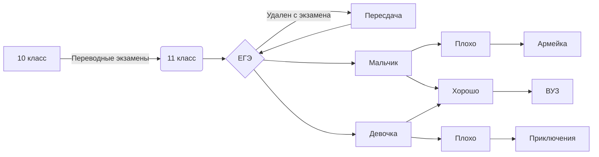
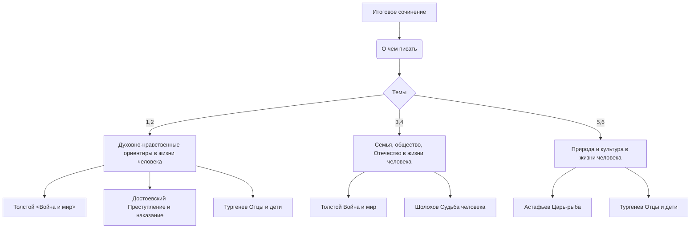

# mrbuttowskii.github.io
# Количество таблиц: SELECT COUNT(*) FROM INFORMATION_SCHEMA.TABLES WHERE TABLE_TYPE = 'BASE TABLE'
# Выбрать число из информационной схемы, где тип таблицы=базовая таблица
# НАзвания таблиц: SELECT table_name FROM information_schema.tables
# Выбрать все названия таблиц из инф. схемы
# Список пользователей:SELECT *from users
# Выбрать всех из users 
# Узнать все имеющиеся оценки:  SELECT *from grades
# выбрать всех из grades
# Узнать, кто имеет оценки:SELECT*from users,grades;
# Выбрать всех, кто из пересечени users и grades
# Найти себя в базе по имени: SELECT*from users WHERE fam='Чмыхало'
# Выбрать себя из users по фамилии

<iframe allowfullscreen frameborder="0" style="width:640px; height:480px" src="https://lucid.app/documents/embedded/dddb3b01-a59a-49f0-9484-c7466bd21044" id="W3H92SnEHsI."></iframe>

<a href="https://github.com/mrbuttowskii" class="button_1670297318143" target="_blank">
  mrbuttowski
</a>

[http://egena100000.tilda.ws/]
